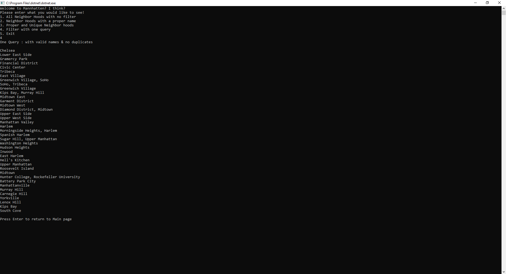

<h1> LINQ</h1>

<h2> Summary </h2>

This project is all about learning how to take in JSON data in C# and read and filter through it!  When running this 
application you can choose what data, specifcally neighbor hoods in the manhatten area.  You can view just all of the 
no filters.  You can view only neighbor hoods with an actual name or maybe you just wanna know all the unique 
neighbor hood names!  1 and 4 seem like they are doing the same unique neighbor hood print, its how they are done 
that is different, check the source code if youre interested in how I did it!

<h5> User Interface </h5>

<h5> All neighbor hoods view </h5>

<h5> All neighbor hoods with a name </h5>

<h5> All unique neighbor hoods </h5>

<h5> All unique neighbor hoods filtered with one query </h5>

<h2> Setup </h2>

-Open VS community  
-Create new project  
-Go to File  
-New  
-New Project  
-In the window on the left you will see a .NET Core option under Visual C# make sure you have that selected  
-Now in the middle section select Console App (.NET Core)  
-Next in the bottom change the name to your choice and change path if you want and then click "Ok"  
-Next click view  
-Then Solution Explorer  
-If it wasnt already there it will open a tab on the right side showing your Solution Explorer  
-Next click on the tiny folder tab in the Solution explorer tab the change to Solution Explorer - Folder View  
-Navigate to Program.cs file and double click to open it  
-Once you have that open copy and paste the source code below into the Program.cs file  
-Hit control S to save the source code you pasted into your file  
-Now go back up to the Solution Explorer - Folder View and hit the little folder tab to change back to the just the Solution Explorer  
-Now its time to run the code in the top nav bar hit Debug  
-Then Click Start Debug to start viewing neighbor hoods filtered from json data! 